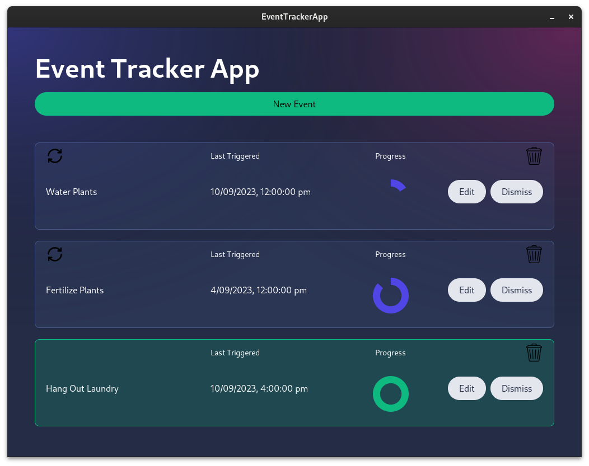
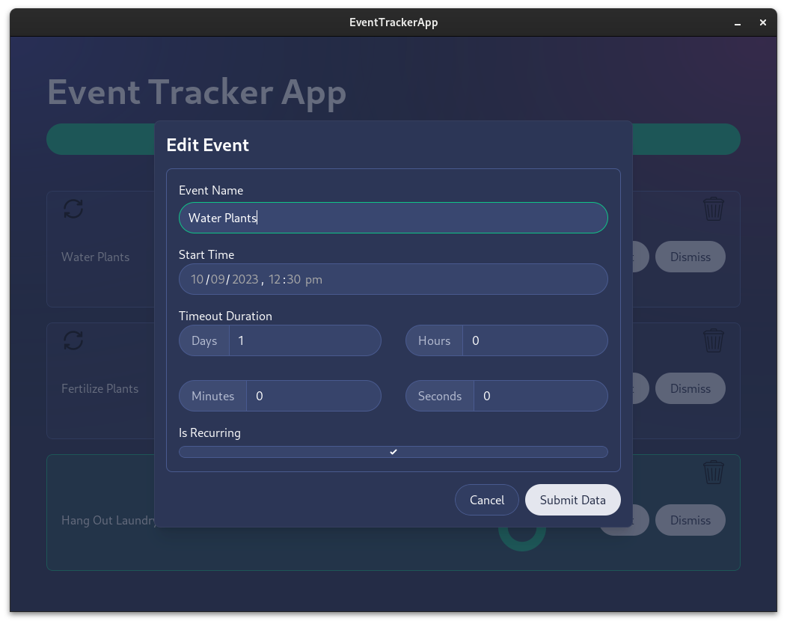

# Event Tracker App

 

Root view | Editing view
:---:|:---:
 | 

## About

A native application to create, track, and manage events. 

Events are stored in an sqlite database, managed and interfaced through [GORM](https://gorm.io/), an Object Relation Mapper for Golang. The native application is written in Svelte (using [skeleton.dev](https://www.skeleton.dev/))and glued together with the Golang backend using [Wails](https://wails.io/).

Events can be created, updated, deleted, and viewed in the app, and events that have been triggered are highlighted to show they need to be addressed.

## Building from Source

First, ensure you have Go installed on your system (version 1.18+) and have run `go get -u .` to install the dependencies for this project. Then, ensure you meet the [requirements for Wails](https://wails.io/docs/gettingstarted/installation/), which you can check using `wails doctor` once installed.

From the root directory, run `wails build` to create an executable. The executable should be saved in the `build/bin` directory.